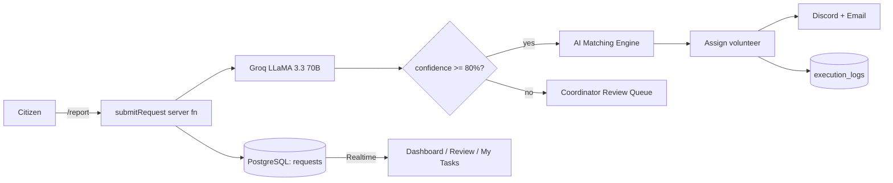

# ResQAI

**AI-powered Disaster Relief & Volunteer Coordination Platform**

<p align="center">
  <a href="https://resqflow-ai.lovable.app"></a>
  <a href="https://github.com/Divakar-18/ResQAI"></a>
  
  
  <a href="LICENSE"></a>
</p>

- **Live Demo:** https://resqflow-ai.lovable.app
- **Repository:** https://github.com/Divakar-18/ResQAI

---

## Project Overview

ResQAI is an enterprise-grade emergency intake and dispatch platform for NGOs, civil-defense agencies, and disaster-relief coordinators. Citizens report incidents through a public intake form; a Groq-hosted LLM classifies each report in real time; the system either auto-dispatches the highest-ranked volunteer or routes the case to a human review queue. Every action streams live to a command-center dashboard and is persisted with a full audit trail.

## Key Features

- **AI classification** — Groq `llama-3.3-70b-versatile` returns structured JSON: intent, priority, department, sentiment, confidence, recommended resources, ETA, and required volunteer skill.
- **Autonomous dispatch** — requests with confidence ≥ 80% auto-execute via a 100-point AI Matching Engine (distance, skills, historical performance, workload).
- **Human-in-the-loop** — lower-confidence cases route to a Coordinator review queue with AI justification and ranked volunteer suggestions.
- **Real-time Command Center** — dashboards, review queue, and task lists update instantly via Supabase Realtime.
- **Live map intake** — OpenStreetMap + Leaflet with Nominatim reverse geocoding.
- **Multi-channel alerts** — Discord webhooks + transactional email for critical incidents.
- **Immutable audit log** — every AI decision, assignment, and status change persisted.
- **RBAC** — Citizen (public), Volunteer (task pipeline), Coordinator / Admin (dispatch + settings). First registered user is auto-promoted to Admin + Coordinator.

## AI Workflow

1. Citizen submits an intake form (text + optional GPS + reverse-geocoded address).
2. Server function persists an anonymous request row.
3. Groq API classifies the payload using a strict JSON schema.
4. A confidence gate branches into **auto-execute** or **review**.
5. Auto-execute scores every eligible volunteer and picks the top match.
6. Discord + email notifications fire; audit log records model, latency, and decision.

## Architecture Diagram



## Tech Stack

- **Frontend:** React 19, TanStack Start (Router + Query), Tailwind v4, framer-motion, Leaflet.
- **Backend:** TanStack `createServerFn` on Cloudflare Workers, Supabase Postgres with RLS.
- **AI:** Groq API (`llama-3.3-70b-versatile`) with `response_format: json_object`.
- **Notifications:** Discord webhooks, Lovable Email (`@lovable.dev/email-js`).
- **Maps:** OpenStreetMap tiles + Nominatim reverse geocoding.
- **Tooling:** Bun, Vite 7, ESLint, Prettier, strict TypeScript.

## Folder Structure

```text
ResQAI/
├── .github/            # CI, issue & PR templates
├── docs/               # architecture, api, deployment, workflow
├── database/           # SQL schema mirror + seed helpers
├── public/             # static assets
├── scripts/            # maintenance & dev scripts
├── src/
│   ├── routes/         # TanStack file-based routes (pages + API)
│   ├── components/     # shadcn UI + feature widgets
│   ├── hooks/          # React hooks (realtime, etc.)
│   ├── lib/            # server functions + domain services
│   ├── integrations/   # Supabase + Lovable clients
│   ├── utils/ constants/ types/ assets/
│   └── styles.css
├── supabase/           # local Supabase config
└── tests/              # unit / integration / e2e
```

## Installation

```bash
git clone https://github.com/Divakar-18/ResQAI.git
cd ResQAI
bun install
cp .env.example .env    # fill in values (see below)
bun run dev
```

Build for production:

```bash
bun run build
```

## Environment Variables

Never commit real values. Use placeholders locally and set real values only in your deployment environment.

**Client (Vite, browser-visible):**

```bash
VITE_SUPABASE_URL=https://<your-project>.supabase.co
VITE_SUPABASE_PUBLISHABLE_KEY=<supabase-publishable-key>
VITE_SUPABASE_PROJECT_ID=<your-project-id>
```

**Server (secret, backend only):**

```bash
SUPABASE_URL=https://<your-project>.supabase.co
SUPABASE_PUBLISHABLE_KEY=<supabase-publishable-key>
SUPABASE_SERVICE_ROLE_KEY=<supabase-service-role-key>
GROQ_API_KEY=<groq-api-key>
LOVABLE_API_KEY=<lovable-api-key>    # for Lovable Email
```

Runtime organization settings (Discord webhook, notify email, auto-execute threshold) live in the `org_settings` table and are edited from `/settings` in the app.

## API Integrations

| Service | Purpose |
|---|---|
| Groq Cloud (`llama-3.3-70b-versatile`) | Emergency classification |
| Supabase (Postgres + Auth + Realtime) | Persistence, RBAC, live sync |
| OpenStreetMap + Nominatim | Map tiles + reverse geocoding |
| Lovable Email (`@lovable.dev/email-js`) | Transactional alerts |
| Discord Webhooks | Critical-incident broadcasts |

## Screenshots

Place images in `docs/screenshots/` and they'll render here:

| Landing | Command Center | Review Queue |
|---|---|---|
| `docs/screenshots/landing.png` | `docs/screenshots/dashboard.png` | `docs/screenshots/review.png` |

## Live Demo

- **App:** https://resqflow-ai.lovable.app
- **Repository:** https://github.com/Divakar-18/ResQAI

## Future Scope

- Multi-tenant orgs with per-agency dashboards
- NGO / Department partner portals
- SMS + WhatsApp intake channels
- Offline-first volunteer PWA
- Vector-based incident deduplication
- Predictive resource pre-positioning

## Contributors

- [@Divakar-18](https://github.com/Divakar-18) — Creator & maintainer

Contributions welcome — see [`CONTRIBUTING.md`](CONTRIBUTING.md) and [`CODE_OF_CONDUCT.md`](CODE_OF_CONDUCT.md).

## License

[MIT](LICENSE) © ResQAI contributors.

## Acknowledgements

Groq · Supabase · TanStack · OpenStreetMap · Lovable · shadcn/ui · IBM SkillsBuild AI Automation program.
